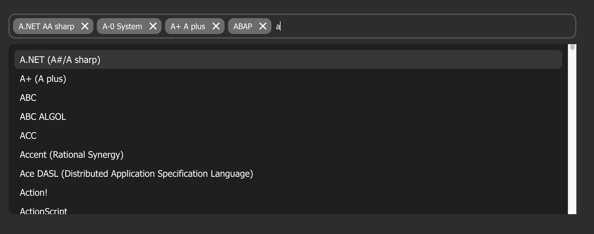

# Vue 3 autocomplete

This is a simple library that allows you to input tags into a field, outputting an array. There's the option to disable duplication, asynchronous loading of lists, control props, and much more.



## Props

- `list`: (Array, ['John', 'Doe']), Default = empty, List of tags for autocomplete.
- `disabledSymobols`: (String, "#!=&)(/"), Default = null, List in string of disabled symbols or letters.
- `min`: (Number, 1), Default = 1, Minimum length for 1 tag.
- `max`: (Number, 1), Default = 200, Maximum length for 1 tag.
- `dublicates`: (Boolean, false), Default = false, Available of disable dublcate tags.
- `placeholder`: (String, "Start typing"), Default = null, Placeholder for input tag
- `v-model`: v-model value (Array, ['John', 'Doe']), Dynamic v-model value

## Events
All you need to do is attach a watch event to the v-model value, but if that's not enough for you, I've added a few more events.

- `@inputData` = return value of input field, when user typing or pasting something.
- `@changed` = return value of v-model when inner array or v-model changed. Starts first time on components mount, and every time when v-model changed.
- `@open` = return dropdown trigger, opened or closed.


## Simple example
```html
<venAutocomplete
  :list="list"
  placeholder="Write something, and press ',' or 'enter' or 'tab'"
  disabled-symobols="#!=&)(/"
  :max="30"
  :min="3"
  :dublicates="true"
  v-model="vvalue"
  @inputEvent="inputEvent"
  @changed="changed"
  @opened="opened"
/>
```


## Help links: 
- If my solution was helpful to you, please give me a star on [Github](https://github.com/Venegrad/vue3-autocomplete) or get my day better with: 
- USDT TRC20: `TKXybH3YoFvT5h8bQFLdkDBtiXA65y7xaB`
- USDT ERC20: `0xc3efeB4825E350eE5D6B032Aa1dE144B09B5bB0D`
